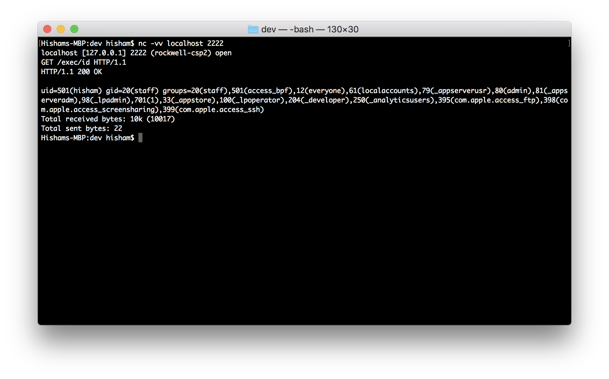

# Normal Web Server

Note: This isn't normal, it is backdoored.

Example:  ./normal_web_server <PORT>

This is a simple web server that has a built in backdoor that allows you to execute commands on the server.
The server can handle GET requests only. It will reply with bad requests if other requests types used.

In order to execute commands you have to send a GET request as the following: 
	GET /exec/COMMAND HTTP/1.1 
	GET /exec/COMMAND HTTP/1.0 
	
Note: The server has several bugs, and I am bored to fix them. Will fix them later.

